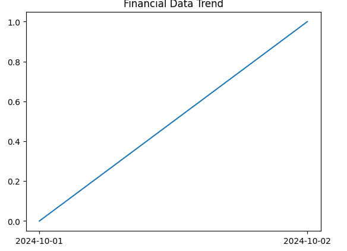

# Automated Data Pipeline for BI Reporting

This project demonstrates an end-to-end ETL pipeline that extracts financial data, performs data transformations, and loads it into AWS Redshift for business intelligence reporting.

## Project Structure
- **scripts/**: Contains Python scripts for data extraction, transformation, and loading.
- **config/**: AWS configuration files.
- **notebooks/**: Jupyter Notebook for data visualization and insights.
- **docker-compose.yml**: Docker setup for local testing.

## Features
- AWS S3 for data storage.
- AWS Redshift for data warehousing.
- Python for ETL processing.
- Matplotlib/Tableau for BI reporting.

## Setup
1. Clone the repository.
2. Install required dependencies: `pip install -r requirements.txt`.
3. Set up AWS services and configure `aws_config.json`.
4. Run the ETL pipeline: `python scripts/extract.py`, `python scripts/transform.py`, `python scripts/load.py`.
5. Visualize the data using Jupyter Notebook.

## Future Enhancements
- Integrate AWS Glue for automated workflow management.
- Implement data quality checks and validation.

